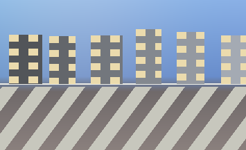
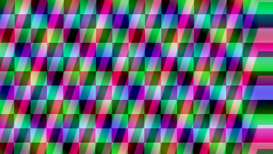
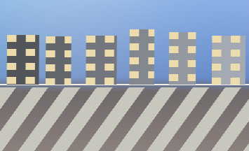
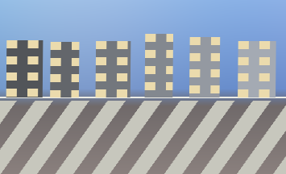
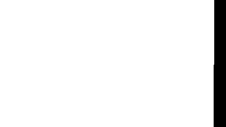
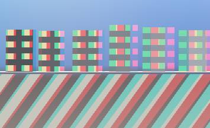
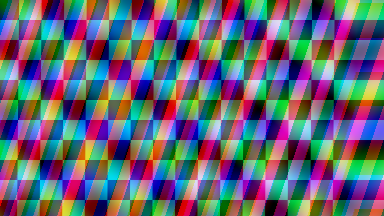
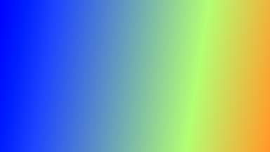
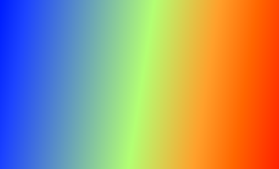
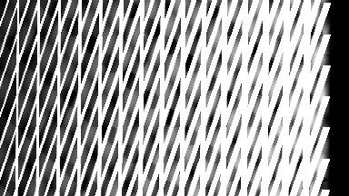

# Stereo Remap Lab (Portfolio Edition)

A compact, deterministic stereo/disparity remapping lab in pure Python (`numpy` + `pillow`).

## Stereo convention
- Disparity: `d = x_left - x_right`
- Left-to-right synthesis: `x_right = x_left - d`
- Larger positive disparity means closer depth.

## Features
- Deterministic synthetic scenes:
  - `SlantedPlaneScene` (monotonic, analytic right-view ground truth)
  - `LayeredRectScene` (occlusions/disocclusions)
- Two warpers:
  - Backward monotonic row inversion + bilinear sampling
  - Forward z-buffer splat with hole mask
- Hole filling:
  - Rowwise nearest fill
  - Diffusion smoothing inside holes
- Disparity remap operators:
  - `scale_shift`, `soft_clip`, `object_popout`, `depth_grade`
- Metrics:
  - `PSNR`, `L1` photometric error

## Install
```bash
pip install -e ".[dev]"
```

## Run
```bash
pytest -q
python scripts/make_showcase.py
python scripts/benchmark.py
```

`make_showcase.py` writes outputs to `artifacts/showcase/` and copies committed preview assets to `docs/assets/`.

## How to read the results
- `left.png`, `right_before.png`, `right_after.png` are standard RGB images of the same scene.
- `right_before.png` should visually match `right_gt.png` in valid regions (high PSNR confirms this).
- `right_after.png` should show stronger horizontal shifts than `right_before.png` because disparity was remapped.
- `disp_before.png` and `disp_after.png` are false-color disparity visualizations (they are not scene colors).
- `anaglyph_*` images encode stereo fusion: red channel from left, green/blue from right.
- `layered_*_nans.png` marks disocclusion holes in magenta; `layered_*_filled.png` shows hole-filled outputs.

## Repository layout
```text
stereo-remap-lab/
  README.md
  LICENSE
  pyproject.toml
  .github/workflows/ci.yml
  AGENTS.md
  src/stereo_remap/
    __init__.py
    io.py
    geometry.py
    metrics.py
    pipeline.py
    synthetic.py
    viz.py
    remap/operators.py
    warp/forward.py
    warp/backward.py
    warp/holes.py
  scripts/
    make_showcase.py
    benchmark.py
  tests/
    test_geometry.py
    test_warp_backward.py
    test_warp_forward.py
    test_remap_ops.py
    test_pipeline_smoke.py
  docs/
    assets/
    design.md
```

## Showcase
### Inputs/outputs







### Stereo fusion



### Disparity and error




